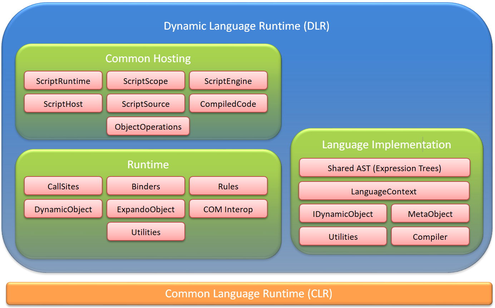

# 2 Architecture Introduction

Microsoft is building the Dynamic Language Runtime (DLR), which adds to the CLR a set of services designed specifically for the needs of dynamic languages. The CLR has good support for dynamic languages already, and [IronPython](https://github.com/IronLanguages/ironpython2). The DLR adds functionality to make it easier to port and use dynamic languages on the CLR. The DLR key pieces are:

- common hosting model
- shared abstract semantic tree representation (Expression Trees)
- support to make it easy to generate fast dynamic code (DynamicSites, SiteBinders, Rules).
- shared dynamic type system (**IDynamicMetaObjectProvider**)
- utilities (default binder, tuples, big integers, adapters for existing static types to participate in the **IDynamicMetaObjectProvider** protocol, support for new static types to easily participate in **IDynamicMetaObjectProvider** protocol, etc.)

With these additional features, it is much easier to build high-quality dynamic language implementations for .NET. Also, these features enable dynamic languages built on the DLR to share libraries written in other dynamic languages or static languages on the .NET CLR.

Let's take a look at 1000 words using picture compression. Here is a conceptual architecture diagram (not all labels are actual type names), followed descriptions of the boxes:

In CLR 4.0, the parts of the DLR shipping are depicted here (pink boxes), squeezing some boxes together:

The following sub sections contain a very brief overview of the architectural pieces depicted above.

<h2 id="common-hosting">2.1 Common Hosting</h2>

**ScriptRuntime** &mdash; This is the starting point for hosting. The **ScriptRuntime** represents global script state, such as referenced assemblies and a global object (a **ScriptScope**). You can have more than one **ScriptRuntime** per .Net **AppDomain**. You can load assemblies from which a **ScriptRuntime** coordinates with **ScriptEngine**s to make namespaces and types available to script code.

**ScriptScope** &mdash; This essentially represents a namespace. Hosts can bind variable names in **ScriptScope**s, fetch variable values, etc. Hosts can execute code within different scopes to isolate free variable resolutions.

**ScriptEngine** &mdash; These are the work horse and represent a language's semantics. They offer various ways to execute code and create **ScriptScope**s and **ScriptSource**s. You can have a single instance of a given language's engine in a **ScriptRuntime** instance.

**ScriptSource** &mdash; These offer methods for reading and executing code in various ways from different kinds of sources.

**CompiledCode** &mdash; These represent code that has been compiled to execute repeatedly without having to compile it each time, and they have a default **ScriptScope** the code runs in. The default scope may have optimized variable storage and lookup for the code. You can always execute the code in any **ScriptScope** if you need it to execute in a clean scope each time, or you want to accumulate side effects from the code in another scope.

**ScriptHost** &mdash; This lets you provide a custom **PlatformAdaptationLayer** object to override file name resolution. For example, you might only load files from a particular directory or go to a web server for files. A host communicates its sub type of **ScriptHost** to the DLR when it creates a **ScriptRuntime**. Many hosts can just use the DLR’s default **ScriptHost**.

**ObjectOperations** &mdash; These provide a large catalogue of object operations such as member access, conversions, indexing, and operations like addition. There are several introspection and tooling support services. You get **ObjectOperation** instances from engines, and they are bound to their engines for the semantics of the operations.

<h2 id="runtime">2.2 Runtime</h2>

**CallSites** &mdash; These provide a caching mechanism per operation or call in dynamic code. Without **CallSite**s, every time you executed `a + b` the DLR would have to fully search for how to add `a` and `b`. With **CallSite**s the DLR can store a rule for what to do with `a` and `b` given their characteristics (which typically means their type).

**Binders** &mdash; These represent a language's semantics for performing a specific operation in a **CallSite**, including any metadata about the **CallSite**. Binders get called when there is a cache miss in a **CallSite**, and they inspect the operands of the **CallSite** to compute how to perform the operation in the **CallSite**. Binders communicate how to perform operations to **CallSite**s using Expression Trees.

**Rules** &mdash; These represent a single computation or binding of how to perform an operation in a **CallSite**. Rules have a test for when the rule is valid (typically just testing the static runtime type of the operands). Rules have a target or expression for how to perform the operation, given the characteristics of the operands guaranteed by the Rule's test. The test and target expressions come from the binders.

**DynamicObject** &mdash; This is a convenience type for library authors. **DynamicObject** has virtual methods for all the abstract operations you can perform on via **IDynamicMetaObjectProvider** and **DynamicMetaObject**. You can simply derive from **DynamicObject** and implement the operations you care about. You do not have to create Expression Trees or create your own **DynamicMetaObject** to providing binding to a **CallSite**. The DLR does that for you.

**ExpandoObject** &mdash; This is a convenience object for library authors. They can delegate to it or use it directly as a simple dynamic object that lets you add, set, and remove members to the object at runtime.

**Utilities** &mdash; There are some helper classes for implementing binders, producing rules, etc. For example, there is a **DefaultBinder** that IronPython and IronRuby share for doing .NET binding. Some languages specialize their .NET binding, such as C\# and VB, but other languages may be able to make use of the **DefaultBinder**.

**COM Interop** &mdash; The DLR provides an **IDynamicMetaObjectProvider** and **DynamicMetaObject** for COM objects to participate in the dynamic operations and **CallSite**s. The DLR uses **IDispatch** to bind to COM objects.

<h2 id="language-implementation">2.3 Language Implementation</h2>

**Shared AST (Expression Trees)** &mdash; This is one of the core pillars of the DLR. We have extended LINQ Expression Trees to include control flow, assignment, etc. We also ship the sources for all of Expression Trees v1 and v2 (the new stuff for the DLR). Expression Tres are part of lowering the bar for porting languages to .NET, and we use them in the binders and **DynamicMetaObject** protocols.

**LanguageContext** &mdash; These are the objects that represent a language that is implemented on the DLR and support the DLR's hosting model. These are the workhorse for executing code, with many members that support various higher-level features in the DLR.

**IDynamicMetaObjectProvider** &mdash; This is the type implemented by languages and library authors who want to control the dispatching and binding logic for the DLR's interoperability protocol. It is foremost just a jumper to get **DynamicMetaObjects**.

**DynamicMetaObject** &mdash; This type is implemented by languages and library authors to represent an object in an abstract operation and how to perform binding for that object. A **DynamicMetaObject** has several methods representing the abstract operations such as fetching members, setting members, invoking a member, invoking the object itself, instantiating the object, or performing standard operations (addition, multiplication, etc.).

**Compiler** &mdash; The DLR ships an Expression Tree compiler, **Expression\<T>.Compile** that returns a delegate for invoking the code represented by the tree.

**Utilities** &mdash; There are some helper classes for implementing languages. The DLR has a **GeneratorExpression** that can be used in a **LambdaExpression** for creating what C\# calls iterators. The DLR rewrites the expression tree, which contains **YieldExpression**s, to a new tree that open codes the state machine for re-entering the iteration and re-establishing any dynamic state (for example, `try`-`catch`'s). There are math helpers such as **BigInteger**, **Complex**, and **Tuple**s. There is a **GlobalVariableExpression** and optimized module support for creating supporting the DLR hosting model and having faster **ScriptScope**s behind **CompiledCode**.
