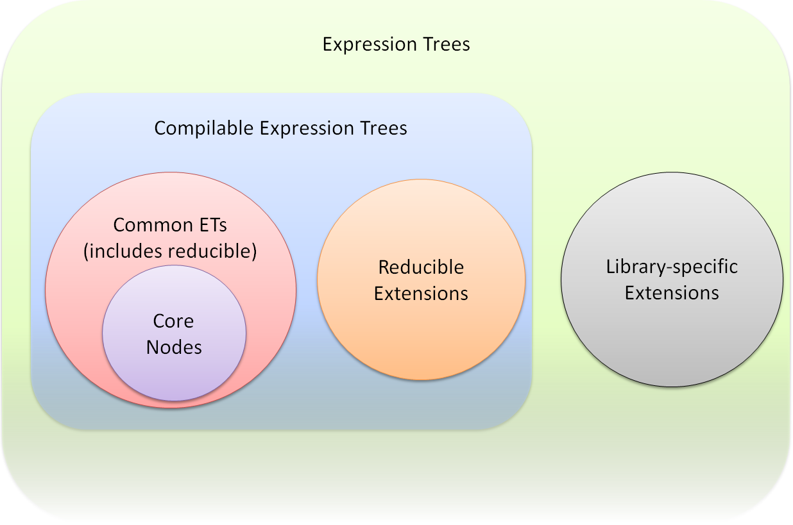

# 5 Language Implementation

It is hard to separate language implementation concepts from the runtime concepts with dynamic languages. However, we try to do so by defining the language implementation aspects of the DLR as are shared ASTs (Expression Trees), **LanguageContext**, language interop with **IDynamicMetaObjectProvider**, compilation, and utilities.

<h2 id="expression-trees">5.1 Expression Trees</h2>

In the .NET Framework 3.5 we created Expression Trees (ETs) to model code for LINQ expressions in C\# and VB. They were limited in .NET 3.5 to focus on LINQ requirements; for example, a **LambdaExpression** could not contain control flow, only a simple expression as its body. Looking forward, there are several reasons we'd like to extend ETs:

- We'd like to further develop a single semantic code model as a common currency for compilation tools.
- We're adding the Dynamic Language Runtime (DLR) into the .NET Framework, and it uses semantic trees to represent code as a means for making it easier to port new dynamic languages to .NET.
- The DLR also uses semantic trees to represent how to perform abstract operations in its dynamic call site caching mechanism.
- We want to support meta-programming going forward where customers can more readily get programs as data, manipulate the data, and emit new code as data based on the input code.

Obviously, to support the above goals, we need more in the ET model than v1 provided. We need to model control flow, assignment, recursion, etc., in addition to simple expressions. There is no plan in .NET 4.0 to add modeling for types/declarations, but we'll consider these for V-next+1 (that is, the next major release after .NET 4.0).

Some quick terminology:

| Term | Definition |
| -- | -- |
| **ET** | A tree structure of instances of **Expression** (direct or indirect). |
| **ET node** | A single instance of **Expression** (direct or indirect). The ET node could be the root of a tree. |
| **ET node type** | The specific class of which the ET node is an instance. |
| **ET kind** | The **Expression.NodeType** property or indicates the value of the **ExpressionType** enum. This is a legacy naming issue. |
| **sub ET** | The root of a tree where the root is an interior or leaf node of some other ET.

The following sub sections are some highlighted concepts for Expression Trees v2.

<h3 id="expression-based-model">5.1.1 Expression-based Model</h3>

One high-order bit to language design is whether to be expression-based. Do you have distinct notions of statements or control flow, or do you have a common concept of evaluating expressions where everything has a value. We decided to stay expression-based, so statements are modeled as having a result value and type.

There are several reasons for this design:

- **Expression** remains the base type for all ET nodes, and we avoid dual type hierarchies.
- **Void** is already allowed as a type, indicating there is no return value for an expression.
- Lambdas don’t change at all from v1 to v2.
- Being expression-based matches many languages (Lisp, Scheme, Ruby, F\#), and it does no harm when modeling other languages. They can easily make expressions be void returning.

Let's look at a couple of examples:

- **BlockExpression** has a value. By default its value is the last expression in the sequence, and its type is the same type as the last expression. This design also allows us to avoid another **CommaExpression** since **BlockExpression** now models this semantics as well.
- We model `if` with **ConditionalExpression**, which returns the value of its consequent or alternative expression, whichever executes. The types of the branches must match the type of the **ConditionalExpression**. If there's no alternative expression, then we use a **DefaultExpression** with the matching type. Languages with distinct notions for statements often have a `e1 ? e2 : e3` expression since their `if` cannot return values, but they can model this with **ConditionalExpression**.

**DefaultExpression** serves two useful purposes in our expression-based model. First the **Expression.Empty** factory returns a **DefaultExpression** with **Type** void. This can be useful if you need an expression in a value-resulting position that matches the containing expressions result type. The second use of **DefaultExpression** is when you do have a non-void **Expression** in which you do need to sometimes return the `default(T)` value. Without this expression, you would have to generate a lot more ET to express `default(T)`.

Often you do not need to use **Expression.Empty** to match a containing node's result type. There are expressions used in common patterns, typically control flow expression, where the result value is not used. For these common patterns, some nodes implicitly convert to `void` or squelch a result value. **SwitchExpression**, **ConditionalExpression**, **TryExpression**, **BlockExpression**, **LambdaExpression**, **GotoExpression**, and **LabelExpression** all automatically convert their result expression to `void` if they themselves have a `void` **Type** property (or delegate with result type in the case of lambdas).

<h3 id="reducible-nodes">5.1.2 Reducible Nodes</h3>

We have a tension for [what level of abstraction to provide in our model](..\expr-tree-spec\introduction.md#model-abstraction-level). While we think Design Time Language Models have a distinct mission from Expression Trees v2, we would like to allow for smooth interoperability between them. We enable higher-level models (even language-specific models) that can reduce to a common set of ET v2 node types that all consumers can process. Programs can query an ET node as to whether it reduces, and if so, a program can call on the node to reduce itself. When a node reduces, it returns a semantically equivalent ET with a root node than can replace the original ET node.

Reductions are allowed to be partial. The resulting ET may include nodes that need to be further reduced. Typically the immediate result of reducing one node comprises only children that are common ET v2 node types. **Expression.Compile** only compiles common node types and those that reduce to common nodes. If a node type does not reduce or does not reduce to only common nodes, then it may still be useful as part of a library-specific set of extensions that model code. An example might be a Design Time Language Model for code that either has too many errors to reduce or that is part of a model too specific to tooling needs to bother reducing it to common nodes.



The ET v2 common set of nodes will include some reducible nodes. For example, for meta-programming goals, there will be higher-level iteration models. We'll include **ForExpression** for counter termination, **ForEachExpression** for member iterations, **WhileExpression** for test first iterations, and **RepeatUntilExpression** for test last iterations. We'll also include a fundamental **LoopExpression** to which the other iteration models reduce. Other examples include **BinaryExpression** with node kind **AddAssign** (compound assignment) or **UnaryExpression** with node kinds **PreIncrementAssign** and **PostIncrementAssign**.

> **Note**, due to time constraints we cut the higher-level iteration node types for .NET 4.0, but they will likely show up soon in the DLR's codeplex open source project.

Common ET nodes with a given node kind are either reducible always, or never. That is, a node is not conditionally reducible based on other properties it has that may be different for different instantiations. For example, the **GeneratorExpression** nodes are always reducible. Regardless of the reducibility, the compiler may have direct support for the node kind, or the compiler may reduce the nodes. For example, when we add **ForEachExpression**, the compiler will likely directly compile it without reducing it.

<h3 id="bound-unbound-and-dynamic-nodes">5.1.3 Bound, Unbound, and Dynamic Nodes</h3>

There are three categories or states of being bound for modeling expressions. More commonly mathematicians or computer scientists think of only two, bound and unbound. For example, in the expression "for all `x` such that `0 < x + y < 10`", `x` is a bound variable while `y` is a free reference or unbound variable. If `y` were not present in the expression, the expression would be fully statically bound such that we could evaluate it. However, to evaluate the expression, we need to first bind `y` to some value.

**An unbound ET node:**

- would need to be bound before executing it
- would represent syntax more than semantics
- would have a Type property that is null (see .NET 4.0 vs. V-next+1 note below)

Consider a language that supported LINQ-like expression and that also had late-bound member access (for example, if VB added late-bound LINQ). You would then need to model unbound trees for the lambda expression in the following pseudo-code:

``` csharp
o.Where( lambda (x) => x > 0 )   #o had late bound semantics
```

To be able to execute an ET modeling this code, you would need to inspect the runtime type of `o`, search its `Where` overloads, and pattern match for one that can take a delegate. Furthermore, you would need to match lambda expression to the delegate. The delegate needs take an argument and returns a value with some type. The delegate's type for `x` needs to make sense to bind `>` to an implementation taking the type of `x`, an operand assignable from integer, and returning the type of the delegate.

A key observation in this situation is that the late-bound node representing the call to `Where` necessarily has language-specific binding information representing the lambda. The representation cannot be language-neutral semantically. It also can't even be just syntax in any common representation because you need the language that produced the ET to process the lambda representation in the presence of runtime type information while binding. Support for unbound ETs may not be a good solution or one worth trying to share across languages.

**NOTE:** Since no languages currently support late bound LINQ expressions, we won't actually allow **Expression.Type** to be null in .NET 4.0. We'll reconsider this in V-next+1 if we think ETs are useful to languages that need to represent unbound trees like the lambda expression in the example above.

**In the ET v2 model, a bound ET node:**

- has non-`null` **Type** property (that is, we statically know its type)
- could be dynamic expression

A dynamic expression often has a **Type** property that is **Object**, but its **Type** that is not null. It might not be **Object** as well. For example, in `if x > y` the ET node for `>` could be typed **Boolean** even if it is a dynamic node.

**The ET v2 model includes dynamically bound nodes that:**

- must be resolved at run time to determine how to perform the operation they model
- represented by **DynamicExpression** nodes

<h4 id="dynamicexpression-node">5.1.3.1 DynamicExpression Node</h4>

The **DynamicExpression** has binding information representing the metadata that further describes the expression beyond the ET node type and any children it has. For example, an ET representing the dynamic expression for comparing a variable to a string literal might have a flag in its binding information indicating whether the compilation unit had an option set to compare strings case-sensitively (which VB has). The binding information also encapsulates the language that created the ET node. The language determines the semantics of the dynamic expression at runtime when its binder searches for an implementation of the operation represented by the node.

<h4 id="binding-information-in-expression-nodes">5.1.3.2 Binding Information in Expression Nodes</h4>

Expression nodes can have semantic hints or specifications that are more detailed than, for example, **BinaryExpression Add** on **Int32**s or **MethodCallExpression** with instance and name. These nodes can have **MethodInfo**s attached to them to indicate the exact implementation of **Add** or resolution of method name to invoke. The **MethodInfo**s serve two main purposes. The first is to be very exact when creating a node what the implementation is for the node's semantics. Language implementations should supply **MethodInfo**s rather than leaving method resolution to the **Expression** factories because those factories may not resolve overloads in the same way the language would. The second job of the **MethodInfo**s is to provide hints to LINQ providers that might interpret ETs. Those providers can have tables mapping to implementations of the node's semantics when they aren't actually compiling the ET and executing in a .NET run time.

This extra information is required with **DynamicExpression** nodes. They must have binding information that can be emitted when compiling. The binding information informs the run-time binder how to search for a correct implementation of the node's semantics, given the run-time operands that flow into the operation represented by the ET node. ETs use a **CallSiteBinder** as the binding information representation, not **MethodInfo**. In fact, the **CallSiteBinder** is also the run-time object used in the DLR's **CallSite**s that manage the fast dynamic dispatch for dynamic operations. **CallSiteBinder** encapsulates both the binding information for the exact semantics of the node and the language that created the node, which governs the binding of the operation at run time.

Two design issues arise immediately from the choice to use **CallSiteBinders** vs. **MethodInfo**s. The first is serializability. The ET design supports fully serializable ETs but doesn't enforce that they are always serializable. One reason we use the **CallSiteBinder**s in the **DynamicExpression** is that they naturally fit exactly what the binding information is that the ET needs and help in hosted execution scenarios. If a language produces an ET as part of a hosting scenario to immediately execute the ET, then the binder can tuck away pointers to live data structures used by the language's engine. Languages can still produce ETs with **DynamicExpression**s that are serializable if they need to do so.

The second design issue is re-using **MethodInfo**s by deriving custom implementations for use with **DynamicExpression** nodes. There's a nice consistency in representing the binding information as a **MethodInfo**, looking on at ETs only. However, the roles played by the **MethodInfo** are different than the binding information on **DynamicExpression**. It is more important to have the dynamic binding information be consistent across ETs, the DLR fast dynamic **CallSite**s, and the DLR interoperability **MetaObject** protocol. Not only does **MethodInfo** have many members that would throw exceptions if used for dynamic binding information, it would be awkward to require creating an LCG method so that the **MethodInfo** was invocable. **CallSiteBinder**s are best for detailed semantics capture in **DynamicExpression** nodes, not **MethodInfo**s.

<h3 id="iteration-gotos-and-exits">5.1.4 Iteration, Goto's, and Exits</h3>

Representing iteration has a couple of interesting concepts and design points. How to represent iteration goes to the heart of [what abstraction level to model for expressions](..\expr-tree-spec\introduction.md#model-abstraction-level). Whether to include Goto goes back ages in language design. ETs v2 provides a nice combination of high-level modeling and lower-level support if needed. There are some higher level modeling nodes so that you almost never need Goto, but we provide Goto for reducing some node types to more primitive control flow.

We provide **GotoExpression** because it is needed for C\#, VB, and other languages. The ET v2 **GotoExpression** started with simple, clean semantics designed into C\#. Basically this meant that the target label of the Goto must be lexically within the same function body, and you could only exit inner basic blocks to outer basic blocks. However, we need to accommodate more of VB's older Goto semantics, and we need a richer Goto for some of the ET transformations we do internally (see [section 5.1.4.3](#gotoexpression-capabilities)).

**GotoExpression** has an optional **Value** expression. This allows **GotoExpression** to enable other node types to truly be expressions. The value expression's type must be ref assignable with the type of the **GotoExpression**'s label target. See the following sub sections for more details.

**GotoExpression** has a **Kind** property with a value from **GotoExpressionKind** (**Goto**, **Break**, **Continue**, **Return**). This is explained further in the following sub sections. This is convenience for meta-programming purposes.

<h4 id="loopexpression-and-higher-level-iteration-node-types">5.1.4.1 LoopExpression and Higher-level Iteration Node Types</h4>

Given Goto, we provide a basic **LoopExpression** with explicit label targets for where to break to and where to continue to. Explict labels in **LoopExpression**s have multiple benefits. You can use **GotoExpression** inside the **LoopExpression**'s Body expression and verify the jumps are to the right locations. Explicit labels support languages that can return from or break out of outer loops or scopes, such as JScript or Lisp. Explicit label targets make transformations easier to get right and allow for better error reporting when transformations are not right.

For meta-programming goals, there will be higher-level iteration models. We'll include **ForExpression** for counter termination, **ForExachExpression** for member iterations, **WhileExpression** for test first iterations, and **RepeatUntilExpression** for test last iterations. These will be common nodes that reduce to combinations of **LoopExpression**, **BlockExpression**, **GotoExpression**, etc.

> Due to time constraints we cut the higher-level iteration node types for .NET 4.0, but they will likely show up soon in the DLR's codeplex open source project.

<h4 id="modeling-exits-labelexpression-and-gotoexpression-with-a-value">5.1.4.2 Modeling Exits, LabelExpression, and GotoExpression with a Value</h4>

As many have observed, lexical exits are ultimately just a Goto, proceeding to the end of the function and then returning. Sometimes when you leave a function, you leave one or more values on the stack. The ET model only supports a single return value inherently. Once we had to have Goto, there is an economy of design obtained by merging the models of explicit function return and Goto.

There are a couple of very nice benefits from merging lexical exits and Goto. The biggest is that by having Goto optionally carry a value to its target, more of our nodes became truly expression-based. This makes the overall model more consistent by more fully embracing the benefits of being expression-based. For example, **LoopExpression** is truly an expression that can be used anywhere because you can exit the loop with a value at the break label target.

The second benefit of merging Goto with lexical exits is that we've added explicit label targets to some nodes. This enables more Goto checking in factories and better error messages when compiling. For example, when you have a **GotoExpression** inside a **LoopExpression** with kind **Break**, the expression compiler can ensure the Goto's target is the containing Loop's break label target. Also, when you form a **GotoExpression**, you have to supply the label target which has a Type property. The factory can ensure the Goto and the label target match by type, and the compiler can check the types match the type of the containing expression. Having label targets explicit in the tree also enables tree transformations to be safer and more reliable.

One quirk in the design is how to handle **LabelExpression** which has a **LabelTarget** that marks a destination in code for Goto. If a **LabelExpression** has non-void type, and execution gets to the target via Goto with a value of that type, we're consistent. What happens if I encounter the target location by straight line sequence, and how do we keep the IL value stack consistent? We solve this by adding an optional default value expression to a **LabelExpression** and by specifying the semantics of **LabelExpression** to place its target AFTER the default expression. In practice this works very naturally. For example, a **LambdaExpression**'s **Body** can be a **LabelExpression** whose default value expression is the actual body of the function. Then the actual body of the function, an expression, is the value left on the stack if you naturally flow through the expressions in the body. If you exit via a **GotoExpression** (with node kind **Return**), you have a verifiable target at the end of the function and a verifiable value type that matches the return type from the **Type** property of the **LambdaExpression**'s.

<h4 id="gotoexpression-capabilities">5.1.4.3 GotoExpression Capabilities</h4>

As stated, we expanded Goto capabilities beyond C\#'s. VB is not fully using the DLR yet, but when it does, we will need a more flexible Goto. If we do not allow more cases for **GotoExpression**, VB would need to produce a **VBBlockExpression** and their own **VBGotoExpression** that reduced to a complicated rewriting of the ET. It seems useful to provide the more general **GotoExpression**. However, VB would still need a special **VBBlock** to model their on_error_goto semantics, which seems too specific to a single language to generally model in common ET nodes.

ETs v2 limit Goto lexically within a function. ETs allow jumping into and out of the following:

- **BlockExpression**s
- **ConditionalExpression**s
- **LoopExpression**s
- **SwitchExpression**s
- **TryExpression**s (under certain situations)
- **LabelExpression**s

ETs allow some jumps relative to **TryExpression**s:

- jumping out of **TryExpression**’s body
- jumping out of a **CatchBlock**’s body
- jumping into **TryExpression**’s body from one of its own **CatchBlock**s

The above constitutes what ETs v2 allow. Just by way of examples, we do not allow jumping into the middle of argument expressions, such as those in binary operands, method calls, invocations, indexing, instance creation, etc. We do not allow jumping into or out of **GeneratorExpression**s. You could however jump within a **BlockExpression** used as an argument expression.

<h3 id="assignments-and-l-values">5.1.5 Assignments and L-values</h3>

We model assignments with **BinaryExpression** nodes that have an **Assign** node kind. The factory methods restrict the **Left** expression of the **BinaryExpression** to a fixed set of common ET node types that the compiler recognizes. This permitted ET node types are **ParameterExpression**s, **MemberExpression**s, and **IndexExpression**s.

For ref and out parameters, we also restrict ET node types, but we do allow a few more node types. We additionally allow **BinaryExpression**s with node kind **ArrayIndex**, **MethodCallExpression**s with **MethodInfo** that is **Array.Get**, and the new **UnboxExpression**. The first two are legacy from LINQ ETs v1, and we will [obsolete them eventually](#indexed-locations). **Expression.Compile** handles write backs for these expressions passed to ref and out parameters. We explicitly do not support property accesses wrapped in conversion expressions due to ambiguities with how to convert back when writing back the out or ref value.

> We believe in V-next+1 we can introduce a generalized l-value model. We would add pre and post expressions for temps set up and for write backs. We don't think this model would be overly complex. If added, then l-value positions could be any node type that was writable and had pre and post ETs for setting up temps and writing back values. We would still NOT support l-value positions with property accesses wrapped in conversion expressions.

<h4 id="indexed-locations">5.1.5.1 Indexed Locations</h4>

In ETs v2 we have **IndexExpression** that handles array access, indexers, and indexed properties. You can use these as l-values for assignments and ref/out parameters.

We will obsolete the LINQ v1 support for **BinaryExpressions** with node kind **ArrayIndex** and **MethodCallExpressions** with methodinfo **Array.Get**. We only support those for `ref`/`out` parameters for LINQ v1 compatibility, and we do not support them for the new **BinaryExpression** with node kind **Assign**. The plan, which could change, is as follows:

- In .NET 4.0, add bold red text to MSDN docs around **ArrayIndex** factories. Add bold red text to **MethodCallExpression** factories if methodinfo has `ref`/`out` parameters, and you’re using one of the two nodes (**BinaryExpressions** with node kind **ArrayIndex** or **MethodCallExpression**s with methodinfo **Array.Get**).
- In v-next+1, mark the factory methods as obsolete.
- In v-next+1, issue warnings when compiling `ref`/`out` parameters whose expressions are **BinaryExpression**s with node kind **ArrayIndex** or **MethodCallExpression**s with methodinfo **Array.Get**.
- In v-next+2, remove **ArrayIndex** factories.
- In v-next+2, throw exceptions where we issues warnings in v-next+1.

We also disallow `ref` and `out` arguments for **IndexExpression**. Neither VB nor C\# support these. They are not part of .NET CLS.

When creating **IndexExpression**s, you must supply **PropertyInfo**. Another clean up to the LINQ v1 trees is that you cannot use random get/set method pairs.

<h4 id="compound-assignment-or-in-place-binary-and-unary-operations">5.1.5.2 Compound Assignment or In-place Binary and Unary Operations</h4>

We represent operations such as "+=" and "++" as **BinaryExpression** or **UnaryExpression** nodes with distinct node kinds (for example, **AddAssign**). These nodes are reducible common nodes. They reduce to the appropriate binary assignment expressions or blocks with temps to ensure sub-expressions are evaluated at most once. Regarding dynamic expressions at run time, some languages will need to inspect the l-value expression for .NET types to handle events, properties with delegates, etc., the right way when binding the expression.

<h4 id="user-defined-setting-syntax">5.1.5.3 User-defined Setting Syntax</h4>

Languages that have user-defined setting forms for storable locations should provide language-specific reducible nodes. These nodes can reduce, for example, to a **MethodCallExpression** that takes the arguments defining the location and an argument for the value. We don't provide extensibility for this sort of language feature.

<h4 id="destructuring-assignment">5.1.5.4 Destructuring Assignment</h4>

Languages that support destructuring assignment should provide language-specific reducible nodes. Different languages handle destructuring bind in different ways (first-class carrier objects for the values, single vs. multiple kinds of carrier objects for values, runtime-internal carrier objects or calling conventions, etc.). A language-specific node will allow for better meta-programming consumers working with a given language. These nodes can reduce to an ET with exact semantics represented in common ET v2 nodes types.

<h3 id="blocks-scopes-variables-parameterexpression-and-explicit-lifting">5.1.6 Blocks, Scopes, Variables, ParameterExpression, and Explicit Lifting</h3>

ETs v2 model variable references with **ParameterExpression** nodes and a node kind value of **Parameter**. Initially for readability of code we chose to introduce a **VariableExpression** node type. It turns out in practice this meant much code that processed ETs had to be duplicated due to static typing in languages or had to use `typeof()` to dispatch to the right code if using **Expression** as a variable's type. Very little code actually needed to treat the declarations or references differently.

ETs v2 includes a **BlockExpression** node type that has an explicit list of variables. It creates a binding scope. Producers of ETs can use these to introduce new lexical variables, including temporaries. Blocks do not guarantee definite assignment. Languages need to do that when producing ETs. To initialize variables, **BlockExpression**s must explicitly include expressions in their body to set the variables. Definite assignment semantics is the concern of consumers of trees and compilers that enforce those semantics. Different languages have varying semantics here from definite assignment, to explicit unbound errors, to sentinel `$Unassigned` first class values. Lastly, recall ETs v2 is expression-based, so the value of a **BlockExpression** is the value of the last expression in its body.

Some languages have strong lexical semantics for unique binding of variables. For example, in Common Lisp or Scheme, each iteration around a loop or any basic block of code creates unique bindings for variables introduced in those basic blocks. Thus, returning a lambda would create unique closures environments for each iteration. Some languages, such as Python and F\#, move all variables to the implicit scope of their containing function. ETs v2 supports both models, all depending on where you create the **BlockExpression** in the ET and list variables. For the stronger lexical model, for example with the loop, place the **BlockExpression** inside the loop body and list variables there, instead of putting the **BlockExpression** outside the loop or at the start of the function.

ETs v2 also supports explicit lifting of variables to support languages that provide explicit meta-programming of local variables. For example, Python has a `locals` keyword that returns a dictionary of the lexical variables within a function so that you can manipulate them or 'eval' code against your function's environment. You can use the **RuntimeVariablesExpression** to list the **ParameterExpression**s that you need explicitly lifted.

<h3 id="lambdas-exits-and-result-types">5.1.7 Lambdas, Exits, and Result Types</h3>

Lambdas are modeled with **LambdaExpression** and **Expression\<T\>**. The latter derives from the former, and the `T` is a delegate type. **LambdaExpression.Type** holds the same `T`, and there is a **ReturnType** property that holds the type of value the `T` delegate would return. All lambdas created by the factory methods are actually **Expression\<T\>**. **LambdaExpression** provides the general base type for code that needs to process any lambda, or if you need to make a lambda with a computed delegate type at runtime. **LambdaExpression** supports two **Compile** methods that return a delegate of type **LambdaExpression.Type**, which can be invoked dynamically at run time.

Handling arbitrary returns or exits from lambdas has some interesting issues. Returns from a lambda can be arbitrarily deep in control constructs and blocks. Lexical exits represent a sort of non-local exit from nested control constructs. The expression that is the body of a lambda might have a particular type from the last sub expression it contains. Execution of the ET may never reach this last sub expression because of a **Goto** node. Even though we've added these sorts of control flow to ETs v2, they still keep the constraints ETs v1 had regarding **LambdaExpression.Type** and .**Body.Type**.

<h4 id="ensuring-returns-are-lexical-exits-with-matching-types">5.1.7.1 Ensuring Returns are Lexical Exits with Matching Types</h4>

We model returns with **GotoExpression** and **LabelExpression**. Due to how ETs v2 use these, we have the same verifiable properties discussed in [section 5.1.4.2](#modeling-exits-labelexpression-and-gotoexpression-with-a-value). We can verify exits are lexical. We can verify that the function's return type, its **Body**'s type, and any lexical exits with result values all match in type. At one point in the ETs v2 design, we were not able to ensure the types invariant, and while the v1 behavior was not guaranteed, we didn't want to break that. Note, there is one case from v1 that counters this invariant property of matching types. When the lambda's delegate type has a void return, the body's type does not have to match since any resulting value is implicitly converted to void or squelched.

There is a factory method to create a **LambdaExpression** that only takes an Expression for the lambda's body and a parameters array. This factory method infers the lambda's return type from the body expression. For many ET node types, we only ensure a parent's **Type** property matches the sub expressions' **Type**s that by default produce the result of the parent node. For example, when constructing a BlockExpression, the factory only checks that the last sub expression has the same type as the **BlockExpression**. However, you can get proper checking on lexical exits from lambdas at creation time (without waiting to compile) using **LabelExpression** as the lambda's body.

The best pattern for creating lambdas with returns is to make the **LambdaExpression**'s **Body** be a **LabelExpression**. The **LabelExpression**'s default value expression is the actual body of the function. Then the actual body of the function, an expression, is the value left on the stack if you naturally flow through the expressions in the body. If you exit via a **GotoExpression**, you provide a value expression and a label target. This pattern enables ETs with a verifiable target at the end of the function and that any return value has the appropriate matching type.

You could use a **BlockExpression** as the **LambdaExpression.Body**. You would then have to put a **LabelExpression** as the last expression in the block. If the lambda returned non-void, you would need to make the **BlockExpression.Type** match the **LambdaExpression.ReturnType**. To do this, you would need to make the **LabelExpression.Type** match the block's type, and you would need to fill in the **LabelExpression**'s default value expression with a **DefaultExpression**, supplying the lambda's return type. This is the normal way to think about creating a target to use as the exit location for the function, but it is much more work than using a **LabelExpression** as the lambda's body itself.

When rewriting reducible nodes in a lambda, if you need to create a return from the lambda, you'll need to ensure the **LambdaExpression**'s **Body** is a **LabelExpression**. If there isn't one already, your rewriting visitor will need to create the label target and then as you unwind in the visitor, replace the **Body** of the **LambdaExpression** with a **LabelExpression** using the same label target.

Lastly, what about languages that allow return targets with dynamic extent? Some languages allow closing over function return or block labels (that is, true non-local returns). If these languages do not require full continuations semantics, they could easily map these non-local return label closures to throws and catches that implement the semantics.

<h4 id="throw">5.1.7.2 Throw</h4>

We model **Throw** with a **UnaryExpression**. We had a **ThrowExpression** at one point. To be consistent with the "shape" aspect of re-using expression node types with the same kinds of children or properties, you can think of Throw as an operator with a single argument.

The **Type** property of the **UnaryExpression** with node kind **Throw** does not have to be `void`, which you may expect since the **Throw** never really returns. Using types other than `void` can be useful for ensuring a node has consistently typed children. For example, you might have a **ConditionExpression** with **Type** `Foo`, where the consequent returns a `Foo`, but the alternative is a **Throw**. Allowing the **UnaryExpression** with node kind Throw to have a non-Void Type, you do not have to artificially wrap your alternative in a **BlockExpression** and use a **DefaultExpression** in it.

**CatchBlock**s are helper objects that convey information to a **TryExpression**, like the **MethodInfo**s or **CallSiteBinder** objects some Expression have. **CatchBlock** is not an expression as you might expect, primarily because they cannot appear anywhere any expression can appear. We could have thought of **TryExpression** as having a value from its **Body**, but sometimes its value comes from a **CatchExpression**. This would be analogous to **ConditionalExpression**. However, unlike a language like Lisp where Catch is a first-class expression, we felt the model we settled on is both expression-based and more amenable to .NET programmers.

<h4 id="recursion">5.1.7.3 Recursion</h4>

ETs avoid needing a Y-Combinator expression by simply using assignment. An ET can have a **BlockExpression** with a variable assigned to a **LambdaExpression**. The **LambdaExpression**'s body can have a **MethodCallExpression** that refers to a **ParameterExpression** that refers to the variable bound in the outer scope. The compile effectively closes over the variable to create the recursive function.

<h3 id="generators-github-only">5.1.8 Generators (GitHub only)</h3>

> Cut from .NET 4.0, available only on [GitHub](https://github.com/IronLanguages/dlr).

Generators are first-class concepts in the ET v2 model. However, they are only available in the DLR GitHub source. The code can be re-used readily and ships in IronPython and IronRuby. The basic model is that you create the **LambdaExpression** with your enumerable return type and then use a **GeneratorExpression** inside the lambda to get the yielding state machine. The outer lambda can do any argument validation needed, and the **GeneratorExpression** reduces to code that closes over the lambda's variables. The body of the **GeneratorExpression** can have **YieldExpression**s in it. The generator node reduces to an ET that open codes the state machine necessary for returning values and re-entering the state machine to re-establish any dynamic context (`try`-`catch`, etc.).

The main reason for not shipping generators in .NET 4.0 is they have a couple of features that are specific to Python, and we don't have time to abstract the design cleanly. Python allows `yield` from `finally` blocks, and while we could define what that means, we'd need offer some extensibility here; for example, what happens when the `yield` occurs via a call to **Dispose**. Python requires `yield` to be able to pass a value from the iteration controller into the **GeneratorExpression** body, which the generator may use to change the iteration state.

<h3 id="serializability">5.1.9 Serializability</h3>

The ability to serialize an ET is important. You may want to send the ET as a language-neutral semantic representation of code to a remote execution environment or to another app domain. You might store pre-parsed code snippets as ETs as a representation higher level than MSIL and more readily executable than source. Nothing should prevent the ability to save an ET to disk and reconstitute it.

It will always be possible to create an ET that does not serialize. In fact, in the hosted language scenarios, most produced ETs may not serialize because they are created for immediate execution. In this case it is fine to directly point at data needed for execution that may not serialize. For example, **DynamicExpression** nodes can hold onto rich binding information for use at runtime. They may have references to the **ScriptRuntime** in which they execute or other execution context information.

If a language does need to refer to a **ScriptRuntime** or scope objects for free references to variables, then the language can still create serializable ETs. The entry point to executable code produced from an ET is always a lambda (even if it is an outer most lambda wrapping the top-level forms of a file of script code). The language can create the **LambdaExpression** with parameters for the **ScriptRuntime** and/or variables scope chain through **ScriptRuntime.Globals**. Since the language is in control when it invokes the lambda at a later time, or in another context, it can pass in the execution context the code needs. Finally, if the language uses **DynamicExpression**, it needs to ensure its **CallSiteBinder**s are serializable.

<h3 id="shared-visitor-support">5.1.10 Shared Visitor Support</h3>

ETs v2 provides a tree walker class you can derive from and customize. Customers often asked about tree walkers, and the DLR uses them a lot too. With the advent of Extension node kinds and reducibility, providing a walker model is even more important for saving work and having well-behaved extensions going forward. Without providing a walking mechanism out of the box, everyone would have to fully reduce extension nodes to walk them. Reducing is lossy for meta-programming because usually you can't go back to the original ET, especially if you're rewriting parts of the tree.

As an example, without the visitor mechanism, Extension node kinds inside of Quote (**UnaryExpression**s with node kind **Quote**) would be problematic. The Extensions would be black boxes, and Quote would be unable to substitute for **ParameterExpression**s in the black box. The Quote mechanism would need to fully reduce all nodes to substitute the **ParameterExpression**s. Then the quoted expression would not have the shape or structure that is expected when using Quote. This would make meta-programming with such expression work poorly.

The **ExpressionVisitor** class is abstract with two main entry points and many methods for sub classes to override. The entry points visit an arbitrary **Expression** or collection of **Expression**s. The methods for sub classes to override correspond to the node types. For example, if you only care to inspect or act on **BinaryExpression**s and **ParameterExpression**s, you'd override **VisitBinary** and **VisitParameter**. The methods you override all have default implementations that just visit their children. If the result of visiting a child produces a new node, then the default implementations construct a new node of the same kind, filling in the new children. If the child comes back identity equal, then the default just returns it.

As an **Extension** node kind author, you should override **Expression.VisitChildren** to visit your sub expressions. Furthermore, if any come back as new objects, you should reconstruct your node type with the new children, returning the new node as your result. By default **VisitChildren** reduces the expression to a common node and then calls the visitor on the result. As discussed above, this is not the best result for meta-programming purposes, so it is important that **Extension** nodes override this behavior.

<h3 id="annotations-debugsource-location-only">5.1.11 Annotations (Debug/Source Location Only)</h3>

We had a general annotation mechanism for a long time, but it kept presenting issues both in terms of the nature of the annotations and rewriting trees while correctly preserving annotations. We concluded that most annotations are short-lived for a single phase of processing, and they did not need node identity across tree rewrites. One common case of a persisted annotation, source locations, needed to span phases and rewrites, so we kept support for them specifically. We cut the general support for this release and will look at adding it back in a future release.

Note, all factory methods return new objects each time you call them. They return fresh objects so that you can associate them with unique annotations when that's needed. If you need caching for working set pressure or other performance turning (for example, re-using all Expression.Constant(1) nodes), then you need to provide that.

<h4 id="source-location-information">5.1.11.1 Source Location Information</h4>

We model source location information with a **DebugInfoExpression** that represents a point in the ET where there is debugging information (a la .NET sequence points). A later instance of this class with the **IsClear** property set to `True` clears the debugging information. This node type has properties for start and end location information. It also can point to **SymbolDocumentInfo** which contains file, document type, language, etc.

<h2 id="languagecontexts">5.2 LanguageContexts</h2>

**LanguageContext**s are the objects that represent a language that is implemented on the DLR and support the DLR's hosting model. These are the workhorse with many members that support various higher-level features in the DLR. The common hosting API is a clean layer on top of language implementation API and the **LanguageContext**. You can get call site binders from a **LanguageContext** for creating **DynamicExpression**s in an expression tree so that the dynamic expression has that language's semantics for binding the operation at run time.

These have not been fully designed. The represent a mixture of some thought out architecture but also some haphazard collection of useful functionality. As we move to DLR v2, beyond CLR 4.0, we will clean these up and solidify the other parts of the language implementation API.

<h2 id="type-system">5.3 Type System</h2>

A key concept in the DLR is using .NET's **Object** as the root of the type system. Along with **IDyanmicObject**, these let dynamic languages easily and naturally talk to each other and share code. Equally important, dynamic languages should work well with existing powerful static languages on the platform such as VB.NET and C\#. Their libraries should work well from dynamic languages.

<h3 id="problems-with-wrappers">5.3.1 Problems with Wrappers</h3>

Often implementations achieve interoperability through wrappers and marshaling layers, as this picture of Jython's system:


In this pattern the Python types exist in their own little world. For every underlying type there is a Python-specific wrapper. This standard pattern is okay for supporting a single language. As long as all your code is Python code all your objects are **PyObject**s, and they work great together with the Python-specific information on them. Where this pattern breaks down is when you want to integrate multiple languages. Then every time an object moves from one language to another it needs to be unwrapped from the source language and rewrapped appropriately for the destination. This can have performance issues as these wrapper objects are created and discarded for any cross-language calls.

The wrapper approach can have deeper problems. One challenge is just to figure out what object to pass. For example, if Python has a **PyString**, and it calls a C\# function that expects an **Object**, should Python pass the **PyString** or should it unwrap it into a **String**? These kinds of subtle type issues never have a good answer. There are also big issues with losing object identity when objects are silently wrapped and unwrapped behind the programmer's back.

This wrapper pattern is used by many popular dynamic languages implemented in C. When implementing a dynamic language in C, these kinds of wrappers make a lot of sense because a C pointer doesn't have any useful runtime type information, so you need to decorate it with a layer that can provide the runtime type information that's needed. However, managed runtimes like the CLR provide rich type information for their standard objects, so it should be possible to use those objects directly without the confusion and cost of wrappers and marshalling. This is what the DLR uses for its type system.

<h3 id="object-and-idynamicmetaobjectprovider">5.3.2 Object and IDynamicMetaObjectProvider</h3>

The core of the DLR's type system is based on passing messages to objects. This is a consistent model in object-oriented systems. This simple notion doesn't explicitly talk about types at all, but instead focuses on objects and messages. Every dynamic and static language has its own notion of what a type is - from C\#'s static single-inheritance types to Python's dynamic multiple-inheritance types to JavaScript's prototypes. Trying to reconcile all of these different systems at the type level is extremely complicated. Still, if you view these languages from an objects and messages perspective, there's a big commonality.

In order to support a broad range of languages in this kind of a type system, the DLR needs a standard set of messages. The set needs to be rich enough to capture an appropriately complete set of features in various languages while remaining sufficiently common so that code written in different languages can work together. The DLR has a good set of operations derived from working with several dynamic languages as well as C\# and VB.NET. To see our current set of operations, see the discussion of **DynamicObject** or **DynamicMetaObject**.

Given this set of messages, the DLR needs some mechanisms to allow objects of different types to respond to these messages. While the DLR lets developers treat objects uniformly whether they come from a static or a dynamic language, under the hood the DLR needs to use different mechanisms to implement this message passing for the two different cases. If the type of the object is defined by a statically typed language, the DLR in conjunction with languages uses .NET reflection and standard CLS operator methods. The DLR also handles tasks like making delegates respond to the Invoke message. For types that are defined by a dynamic language, the DLR provides a more dynamic way to respond these messages. Types from dynamic languages implement **IDynamicMetaObjectProvider**, which lets them proffer custom **DynamicMetaObject**s for responding to messages at runtime. **DynamicMetaObject**s enable languages to build their custom behaviors into their objects so that they behave appropriately wherever they are used.

Each language avoids intrinsic knowledge about the details of the type system in the other languages. Languages just have to support the **IDynamicMetaObjectProvider** / **DynamicMetaObject** interoperability protocol and use it when working with objects from other languages.

<h2 id="idynamicmetaobjectprovider-and-dynamicmetaobject">5.4 IDynamicMetaObjectProvider and DynamicMetaObject</h2>

With just the dynamic call sites and binders logic defined above, you can already imagine implementing a language which takes advantage of the DLR’s caching system. You could emit a dynamic call site for each dynamic operation and write a binder that produces rules based on the types of the operands provided. Your binder could understand dynamic dispatch to static .NET types (whose static structure can be gleaned from reflection), as well as dispatch to its own dynamic types, which it natively understands.

However, what if you want the binder for your language to dispatch to functions on objects created by another dynamic language? In this case, reflection will not help you as it would only show you the static implementation details behind that type’s dynamic façade. Even if the object were to offer a list of possible operations to perform, there are still two problems. You would have to rebuild your language every time some new language or object showed up with a new operation your language didn’t know about. You would also really like to perform these operations with the semantics of the target object’s language, not your language, to ensure that object models relying on quirks of that language’s semantics still work as designed.

Also, a library author might have a very dynamic problem domain they want to model. For example, if you have a library that supports drilling into XML data, you might prefer that your users’ code to look like `Customers.Address.ZipCode` rather than `XElement.Element("address").Element("zipcode")`, with the library allowing dynamic access to its data. Another example would be a library doing something similar with JSON objects returned from web services, or other highly dynamic data sources.

What’s needed is a mechanism through which objects defined in various dynamic languages can offer to *bind their own operations* in the way that they see fit, while still obtaining the benefits of the DLR’s caching infrastructure. The most visible part of this mechanism is the **IDynamicMetaObjectProvider** interface, which classes implement to offer dynamic dispatch support to a consuming language. The **DynamicMetaObject** class complements **IDynamicMetaObjectProvider** and serves as the common representation of dynamic metadata, allowing operations to be dispatched on dynamic objects.

<h3 id="idynamicmetaobjectprovider">5.4.1 IDynamicMetaObjectProvider</h3>

An object that offers up either its source language’s semantics or its own type’s custom dispatch semantics during dynamic dispatch must implement **IDynamicMetaObjectProvider**. The **IDynamicMetaObjectProvider** interface has a single method, **GetMetaObject**, which returns a **DynamicMetaObject** that represents this specific object’s binding logic. A key strategy for DLR languages is to use .NET's **Object** as the root of their type hierarchy, and to use regular .NET objects when possible (such as IronPython using .NET strings). However, the **IDynamicMetaObjectProvider** protocol may still be needed for these base types at times, such as with IronRuby's mutable strings.

Library authors (even those using static languages) might implement **IDynamicMetaObjectProvider** so that their objects can present a dynamic façade in addition to their static interface. These objects can then present a better programming experience to dynamic languages as well as enable lighterweight syntax in languages such as C\# with the 'dynamic' keyword.

<h3 id="dynamicmetaobject">5.4.2 DynamicMetaObject</h3>

An instance of **DynamicMetaObject** represents the binding logic for a given object, as well as the result for a given expression that's been bound. It has methods that allow you to continue composing operations to bind more complex expressions.

The three major components of a **DynamicMetaObject** are:

- The value, the underlying object or the result of an expression if it has one, along with information on its type.
- An expression tree, which represents the result of binding thus far.
- A set of restrictions, which represent the requirements gathered along the way for when this expression tree can serve as a valid implementation.

The expression tree and set of restrictions should feel familiar as they are similar in purpose to the implementation and test within a rule. In fact, when a **DynamicMetaObject**-aware binder such as **DynamicMetaObjectBinder** is asked to bind a given **DynamicMetaObject**, it uses the expression tree as the implementation and transforms the restrictions into the test for the rule.

Restrictions should be mostly of a static or invariant nature. For example, they test whether an object is of a specific static type or is a specific instance, something that will not change due to side effects during evaluation of this expression. The expression tree produced by the **DynamicMetaObject** binding may supply other tests that vary on dynamic state. For example, for objects whose member list itself is mutable, the expression tree may contain a test of an exact version number of the type. If this dynamic version test fails, the rule may be outdated, and the call site needs to call the binder and update the cache.

**DynamicMetaObjects** may also be composed to support merging several operations or compound dynamic expressions into a single call site. For example, `a.b.c.d()` would otherwise compile to three or four distinct dynamic call sites, calling three or four **Target** delegates each time the operation is invoked. Instead, the compiler may generate a single call site that represents the compound operation. Then, for each pass through this call site at runtime, the binder can decide how much of this compound expression it can bind in advance, knowing just the type of the source, `a`. If a has a certain static type, the return type of `a.b` may then be known, as well as `a.b.c` and the invocation `a.b.c.d()`, even before the methods are executed. In this case, the binder can return a single rule whose implementation covers the entire invocation.

<h3 id="dynamicmetaobjectbinder">5.4.3 DynamicMetaObjectBinder</h3>

If a language wants to participate not just in the DLR’s caching system, but also interop fully with other dynamic languages, its binders need to derive from one of the subclasses of **DynamicMetaObjectBinder**.

**DynamicMetaObjectBinder** acts as a standard interoperability binder. Its subclasses represent various standard operations shared between most languages, such as **GetMemberBinder** and **InvokeMemberBinder**. These binders encode the standard static information expected across languages by these operations (such as the name of a method to invoke for **InvokeMemberBinder**). At runtime, **DynamicMetaObject**’s **Bind** method accepts a target **DynamicMetaObject** and an array of argument objects. This **Bind** method, however, does not perform the binding itself. Instead, it first generates a **DynamicMetaObject** for each operand or argument as follows:

- **For objects that implement IDynamicMetaObjectProvider:** The **Bind** method calls `.GetMetaObject()` to get a custom **DynamicMetaObject**.

- **For all other static .NET objects:** The DLR generates a simple **DynamicMetaObject** that falls back to the semantics of the language, as represented by this binder class.

This subclass of **DynamicMetaObjectBinder** then calls out to the relevant **Bind…** method on the target **DynamicMetaObject** (such as **BindInvokeMember**), passing it the argument **DynamicMetaObjects**. By convention all binders defer to the **DynamicMetaObjects** before imposing their language's binding logic on the operation. In many cases, the **DynamicMetaObject** is owned by the language, or if it is a default DLR .NET **DynamicMetaObject,** it falls back to the language binder for deciding how to bind to static .NET objects. Deferring to the **DynamicMetaObject** first is important for interoperability.

Binding using **DynamicMetaObjectBinder**s takes place at a higher level by using **DynamicMetaObject**s instead of the .NET objects themselves. This lets the designer of dynamic argument objects or operands retain control of how their operations are dispatched. Each object’s own defined semantics always take highest precedence, regardless of the language in which the object is used, and what other objects are used alongside them. Also, because all languages derive from the same common binder classes, the L0 target methods that are generated can cache implementations across the various dynamic languages and libraries where objects are defined, enabling high performance with semantics that are true to the source.

<h4 id="fallback-methods-implementing-the-languages-semantics">5.4.3.1 Fallback Methods – Implementing the Language’s Semantics</h4>

A major principle in the DLR design is that “the object is king”. This is why **DynamicMetaObjectBinder** always delegates binding first to the target’s **DynamicMetaObject**, which can dispatch the operation with the semantics it desires, often those of the source language that object was defined in. This helps make interacting with dynamic object models feel as natural from other languages as it is from the language the object model was designed for.

However, there are often times when you’ll write code that uses a language feature available in your language, but not in the language of your target object. For example, let’s say you’re coding in Python, which provides an implicit member **\_\_class\_\_** on all objects that returns the object’s type. When dynamically dispatching member accesses in Python, you’ll want the **\_\_class\_\_** member to be available not just on Python objects, but also on standard .NET objects, as well as objects defined in other dynamic languages. This is where **Fallback...** methods come in.

Each of the **DynamicMetaObjectBinder** subclasses defines a **fallback method** for the specific operation it represents. This fallback method implements the language’s own semantics for the given operation, to be used when the object is unable to bind such an operation itself. While a language’s fallback methods may supply whatever semantics the language chooses, the intention is that the language exposes a reasonable approximation of its compile-time semantics at runtime, applied to the actual runtime types of the objects encountered.

For example, the **SetMemberBinder** class defines an abstract **FallbackSetMember** method that languages override to implement their dynamic member assignment semantics. At a member assignment call site, if the target **DynamicMetaObject**’s **BindSetMember** method can’t dispatch the assignment itself, it can delegate back to the language’s **SetMemberBinder**. The **DynamicMetaObject** does this by calling the binder's **FallbackSetMember** method, passing the target **DynamicMetaObject** (itself) and the value to assign to the member.

There are specific subclasses of **DynamicMetaObjectBinder** for each of 12 common language features in the interoperability protocol. For each feature you wish to support binding in your language, you must implement a binder that derives from its class. The [API Reference](#dynamicmetaobjectbinder-subclasses) section blow describes these operation binder abstract classes and provides more details on implementing them.

<h4 id="error-suggestions-for-dynamic-binding-when-static-binding-fails">5.4.3.2 Error Suggestions for Dynamic Binding when Static Binding Fails</h4>

An MO that wants even finer control over the “fallback dance” may also choose to pass an **error suggestion** to a language’s fallback method. An error suggestion supplies a binding recommendation to the language binder, which it is encouraged to use if it fails the binding process. The standard use for this mechanism is to supply an MO containing an expression that binds to dynamic members of the target object. The language gets to do static member binding first, but it should then honor this suggestion if it is non-null rather than throw an error.

Preferring language-based static member binding over the dynamic member binding is used by the **DynamicObject** abstract class. This is described later in this document.

<h4 id="dynamicmetaobjectbinder-subclasses">5.4.3.3 DynamicMetaObjectBinder Subclasses</h4>

There are specific subclasses of **DynamicMetaObjectBinder** for each of 16 common language features in the interoperability protocol. For each feature you wish to support binding in your language, you must implement a binder that derives from its class. The interoperability subclasses are:

<!-- markdownlint-disable MD033 -->
<table>
<thead>
<tr>
<th><strong>Binder base class</strong></th>
<th><strong>Encodes language feature</strong></th>
</tr>
</thead>
<tbody>
<tr>
<td><strong>GetMemberBinder</strong></td>
<td><p>Represents an access to an object’s member that retrieves the value. In some languages the value may be a first-class function, such as a delegate, that closes over the instance, <code>o</code>, which can later be invoked.</p>
<p><em>Example:</em> <code>o.m</code></p>
<p>If the member doesn't exist, the binder may return an expression that creates a new member with some language-specific default value, returns a sentinel value like <code>$Undefined</code>, throws an exception, etc.</p></td>
</tr>
<tr>
<td><strong>SetMemberBinder</strong></td>
<td><p>Represents an access to an object’s member that assigns a value.</p>
<p><em>Example:</em> <code>o.m = 12</code></p>
<p>If the member doesn't exist, the binder may return an expression that creates a new member to hold this value, throws an exception, etc.</p></td>
</tr>
<tr>
<td><strong>DeleteMemberBinder</strong></td>
<td><p>Represents an access to an object’s member that deletes the member.</p>
<p><em>Example:</em> <code>delete o.m</code></p>
<p>This may not be supported on all objects.</p></td>
</tr>
<tr>
<td><strong>GetIndexBinder</strong></td>
<td><p>Represents an access to an indexed element of an object that retrieves the value.</p>
<p><em>Example:</em> <code>o[10]</code> <em>or</em> <code>o[“key”]</code></p>
<p>If the element doesn't exist, the binder may return an expression that creates a new element with some language-specific default value, return a sentinel value like <code>$Undefined</code>, throw an exception, etc.</p></td>
</tr>
<tr>
<td><strong>SetIndexBinder</strong></td>
<td><p>Represents an access to an indexed element of an object that assigns a value.</p>
<p><em>Example:</em> <code>o[10] = 12</code> <em>or</em> <code>o[“key”] = value</code></p>
<p>If the member doesn't exist, the binder may return an expression that creates a new element to hold this value, throw an exception, etc.</p></td>
</tr>
<tr>
<td><strong>DeleteIndexBinder</strong></td>
<td><p>Represents an access to an indexed element of an object that deletes the element.</p>
<p><em>Example:</em> <code>delete o.m[10]</code> <em>or</em> <code>delete o[“key”]</code></p>
<p>This may not be supported on all indexable objects.</p></td>
</tr>
<tr>
<td><strong>InvokeBinder</strong></td>
<td><p>Represents invocation of an invocable object, such as a delegate or first-class function object.</p>
<p><em>Example:</em> <code>a(3)</code></p></td>
</tr>
<tr>
<td><strong>InvokeMemberBinder</strong></td>
<td><p>Represents invocation of an invocable member on an object, such as a method.</p>
<p><em>Example:</em> <code>a.b(3)</code></p>
<p>If invoking a member is an atomic operation in a language, its compiler can choose to generate sites using <code>InvokeMemberBinder</code> instead of <code>GetMemberBinder</code> nested within <code>InvokeBinder</code>. For example, in C#, <code>a.b</code> may be a method group representing multiple overloads and would have no intermediate object representation for a <code>GetMemberBinder</code> to return.</p>
<p>However, a language that chooses to emit <code>InvokeMemberBinder</code>s might try a method invocation on any dynamic object. To support all DLR languages, objects from dynamic libraries must support both Invoke and <code>InvokeMember</code> operations. However, to generalize the implementation of <code>InvokeMember</code>, a dynamic object may fall back to the Invoke functionality in the language binder. Languages that define an <code>InvokeMemberBinder</code> are therefore required to implement the <code>FallbackInvoke</code> method alongside <code>FallbackInvokeMember</code>. Dynamic objects can then implement <code>InvokeMember</code> by resolving a <code>GetMember</code> operation themselves using their own semantics, and passing the resulting target <code>DynamicMetaObject</code> on to <code>FallbackInvoke</code>, which can be implemented by delegating to the language’s existing <code>InvokeBinder</code> functionality.</p></td>
</tr>
<tr>
<td><strong>CreateInstanceBinder</strong></td>
<td><p>Represents instantiation of an object with a set of constructor arguments. The object represents a type, prototype function, or other language construct that supports instantiation.</p>
<p><em>Example:</em> <code>new X(3, 4, 5)</code></p></td>
</tr>
<tr>
<td><strong>ConvertBinder</strong></td>
<td><p>Represents a conversion of an object to a target type.</p>
<p>This conversion may be marked as being an implicit compiler-inferred conversion, or an explicit conversion specified by the developer.</p>
<p><em>Example:</em> <code>(TargetType)o</code></p></td>
</tr>
<tr>
<td><p><strong>UnaryOperationBinder</strong></p>
<p><strong>BinaryOperationBinder</strong></p></td>
<td><p>Represents a miscellaneous operation, such as a unary operator or binary operator, respectively.</p>
<p><em>Examples:</em> <code>a + b</code>, <code>a * b</code>, <code>-a</code></p>
<p>Contains an Operation string that specifies the operation to perform, such as Add, Subtract, Negate, etc.. There is a core set of operations defined that all language binders should support if they map reasonably to concepts in the language. Languages may also define their own Operation strings for features unique to their language, and may agree independently to share these strings to enable interop for these features.</p>
<p>The operator strings in the core set are:</p>
<p><strong>Decrement</strong>, <strong>Increment</strong>,<br>
<strong>Negate</strong>, <strong>Positive</strong>, <strong>Not</strong>,<br>
<strong>Add</strong>, <strong>Subtract</strong>, <strong>Multiply</strong>, <strong>Divide</strong>, <strong>Mod</strong>, <strong>Power</strong>,<br>
<strong>ExclusiveOr</strong>, <strong>BitwiseAnd</strong>, <strong>BitwiseOr</strong>,<br>
<strong>LeftShift</strong>, <strong>RightShift</strong>,<br>
<strong>Equals</strong>, <strong>GreaterThan</strong>, <strong>LessThan</strong>, <strong>NotEquals</strong>, <strong>GreaterThanOrEqual</strong>, <strong>LessThanOrEqual</strong><br>
<strong>InPlaceMultiply</strong>, <strong>InPlaceSubtract</strong>, <strong>InPlaceMod</strong>, <strong>InPlaceAdd</strong>, <strong>InPlaceDivide</strong>, <strong>InPlacePower</strong>
<strong>InPlaceExclusiveOr</strong>, <strong>InPlaceLeftShift</strong>, <strong>InPlaceRightShift</strong>, <strong>InPlaceBitwiseAnd</strong>, <strong>InPlaceBitwiseOr</strong>
</p></td>
</tr>
</tbody>
</table>
<!-- markdownlint-enable MD033 -->