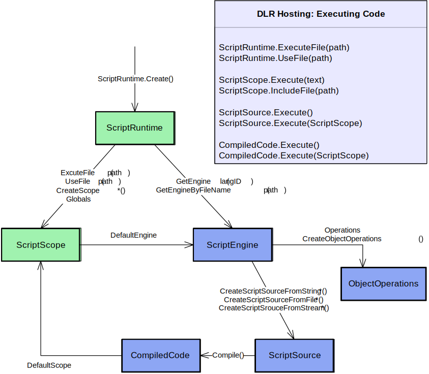

# 2 High-level Hosting Model Concepts

The hosting APIs can be grouped by levels of engagement. Level One uses a couple of types for executing code in scopes and working with variable bindings in those scopes. Level Two involves a few more types and supports more control over how code executes, using compiled code in various scopes, and using various sources of code. Level Three opens up to several advanced concepts such as overriding how filenames are resolved, providing custom source content readers, reflecting over objects for design-time tool support, providing late bound variable values from the host, and using remote ScriptRuntimes.

There are three basic mechanisms for partially isolating state for code executions within a process. .NET offers Appdomains, which allows for code to run at different trust levels and to be completely torn down and unloaded. The DLR offers multiple ScriptRuntimes within an AppDomain, each having its own global object of name bindings, distinct references to .NET namespaces from specified assemblies, distinct options, etc. The DLR also provides ScriptScopes which provide variable binding isolation, and you can execute code in different scopes to work with distinct bindings of free variable references.

The following diagram shows conceptually how hosts relate to ScriptRuntimes and other hosting objects:


It is important for the DLR to support distinct ScriptRuntimes within .NET's AppDomains for a couple of reasons. First, key customers betting on us require the lighter-weight isolation than what AppDomains provide. Second, consider two independent .NET components loading as extensions to an application. Each component wants to provide scripting support to end users. The components should be able to do so without having to worry about how they might clash with other script-enabled components. Multiple ScriptRuntimes also makes the main application's job easier since it does not have to provide a model for independent components getting access to and coordinating code executions around a central ScriptRuntime.

There's a rich set of ways to execute code. Our goal is to strike a balance between convenient execution methods on various objects and keeping redundancy across the types to a minimum. The diagram below shows how to navigate to the key objects for running code. The Sections on Levels One and Level Two below talk about types in this diagram (green being Level One types):



<h2 id="level-one----script-runtimes-scopes-and-executing-files-and-snippets">2.1 Level One -- Script Runtimes, Scopes, and Executing Files and Snippets</h2>

For simple application programmability, you want to provide a host object model that dynamic languages code can use. You then want to execute files of code that consume that object model. You may also want to get the values of variables from the dynamic language code to use dynamic functions as command implementations or event handlers.

There are two types you will use at this level. The ScriptRuntime class is the starting point for hosting. You create a runtime with this class. The ScriptRuntime represents global script state, such as referenced assemblies and a global object (a ScriptScope). The ScriptScope class essentially represents a namespace. Hosts can bind variable names in ScriptScopes, fetch variable values, etc. Hosts can execute code within different scopes to isolate free variable resolutions.

There are a lot of members on these types because they are also used for Level Two and Level Three. For Level One you only need a few members and can ignore the rest. You need to create a ScriptRuntime, from which you might use ExecuteFile or Globals. The Globals object lets you set variables to provide access to a host object model. From ScriptScope, you will likely only use GetVariable and SetVariable.

These types are shown in the diagram:


The ScriptRuntime.GetEngine and ScriptScope.Engine are bridges to more advanced hosting functionality. In Level Two and Level Three scenarios, the other members of ScriptRuntime and ScriptScope will be useful along with ScriptEngine.

<h3 id="code-sample----application-programmability">2.1.1 Code Sample -- Application Programmability</h3>

The following code sample assumes you have a default app .config file (see section 4.13.3.2):

``` csharp
public class Level_1 {
    ScriptRuntime env = ScriptRuntime.CreateFromConfiguration();
    MyHostObjectModel hostOM = new MyHostObjectModel();
    /// <summary>
    /// Shows setting Host OM on globals so that dynamic languages
    /// can import, require, etc., to access the host's OM.
    /// </summary>
    /// my_user_script.py:
    /// import HostModule
    /// def foo () ...
    /// HostModule.UserCommands["foo"] = foo
    /// 
    public void RunFile_Isolated_Scope_ImportsFromHost() {
        env.Globals.SetVariable("HostModule", hostOM);
        // Imagine this runs my_user_script.py above.
        env.ExecuteFile(GetFileFromUserOrSettings());
    }
    delegate void Command();
    /// <summary>
    /// Shows getting command implementations from dynamic language.
    /// Assumes menu item text is command name in table.
    /// Builds on previous function.
    /// </summary>
    public void Run_User_Command_from_MenuItem (string menuItemName) {
        // UserCommands is Dictionary<string, Command>.
        hostOM.UserCommands[menuItemName]();
    }
    /// Fetch scope var as Command.
    ///
    /// <summary>
    /// Shows discovering command implementations from globals in scope.
    /// Above user code explicitly added commands, but this code finds
    /// commands matching a delegate type, Command.
    /// </summary>
    public void Collect_User_Commands_From_File (string menuItemName) {
        env.Globals.SetVariable("HostModule", hostOM);
        ScriptScope scope 
            = env.ExecuteFile(GetFileFromUserOrSettings());
        // UserCommands is dictionary from string to Command.
        Command fun;
        foreach (string id in scope.GetVariableNames()) {
            bool got_fun = scope.TryGetVariable<Command>(id, out fun);
            if (got_fun) {
                my_OM.UserCommands[id] = fun;
            }
        }
    }
```

}

<h2 id="level-two----engines-compiled-code-sources-and-object-operations">2.2 Level Two -- Engines, Compiled Code, Sources, and Object Operations</h2>

The next level of engagement involves operating directly with engines and abstractions of source code and compiled code. You can compile code and run it in any scope or its default scope. You also have more control over how you provide sources to the DLR.

Besides the new types you'll use for Level Two scenarios, you will likely use more of the ScriptRuntime and ScriptScope classes. You'll certainly use their members to get to engines. You'll likely use more flavors of getting and setting variables on scopes as you have richer interactions with dynamic code. You might use the ability of scopes to support executing multiple languages within one scope (using execute methods on engines).

The main new types you'll use in Level Two scenarios are ScriptEngines, ScriptSources, and ObjectOperations. ScriptEngines are the work horse. They offer various ways to execute code and create ScriptScopes and ScriptSources. ScriptSources offer methods for executing code in various ways from different kinds of sources.

You may use ScriptRuntime.LoadAssembly to makes namespaces and types available to script code. The ScriptRuntime coordinates with ScriptEngines, but how script code accesses .NET namespaces and types is language-dependent. The language may require an 'import', 'using', or 'require' construct, or the language may put first class dynamic objects in ScriptRuntime.Globals.

ObjectOperations provide a large catalogue of object operations such as member access, conversions, indexing, and operations like addition. There are several introspection and tool support services that we'll discuss in Level Three scenarios. You get ObjectOperation instances from engines, and they are bound to their engines for the semantics of the operations.

These are the main types of level two:


<h3 id="code-sample----repl-and-merlin-web">2.2.1 Code Sample -- REPL and Merlin Web</h3>

The following code sample assumes you have a default app .config file (see section 4.13.3.2):

``` csharp
public class Level_2 {
    ScriptRuntime env = ScriptRuntime.CreateFromConfiguration();
    public void REPL_fragments {
        ScriptSource input;
        object result;
        // Assume user has chosen a context with the REPL's 
        // default scope and the Python language.
        ScriptScope defaultScope = env.CreateScope();
        ScriptEngine curEngine = env.GetEngine("py");
        // Use interactive source units for special REPL variables
        // or syntax, such as IPy's underscore or VB's '?',
        // provided by standard interpreters for the languages.
        ScriptSource input 
            = curEngine
                .CreateScriptSourceFromString
                  // E.g., input is "x = 'foo'".
                  (GetInputAsString(), 
                   SourceCodeKind.InteractiveCode);
        result = input.Execute(defaultScope);
        REPLOutput.WriteLine(curEngine
                               .Operations
                                 .GetObjectCodeRepresentation(result));
        // Assume user has chosen somehow to switch to Ruby.
        curEngine = env.GetEngine("rb");
        // E.g., input is "puts x"
        input = curEngine
                  .CreateScriptSourceFromString
                    (GetInputAsString(), 
                     SourceCodeKind.InteractiveCode);
        result = input.Execute(defaultScope);
        System.Console.WriteLine
                        (curEngine
                           .Operations
                             .GetObjectCodeRepresentation(result));
        // Assume user has chosen to execute a file from another 
        // language, and you want to set the REPL's context to that
        // file's scope.  Use scope now for interactions like above,
        // and save it for use with this file later.
        ScriptScope scope = env.ExecuteFile(GetFileFromUserOrEditor());
        curEngine = scope.Engine;
    }
    public delegate string OnLoadDelegate();
    // MerlinWeb:
    public void ReUseCompiledCodeDifferentScopes() {
        ScriptEngine engine = env.GetEngine("rb");
        CompiledCode compiledCode 
          = engine.CreateScriptSourceFromFile("foo.rb").Compile();
        // on each request, create new scope with custom dictionary
        // for latebound look up of elements on page.  This uses a
        // derived type of DynamicObject for convenience.
        DynamicObject pageDynObj = GetNewDynamicObject();
        pageDynObj["Page"] = thisRequestPage;
        ScriptScope scope = engine.CreateScope(pageDynObj);
        compiledCode.Execute(scope);
        // Expect on_Load function name to be defined, or throw error.
        // Could have used scope.GetVariable but it's case-sensitive.
        scope.GetVariable<OnLoadDelegate>("on_Load")();
    }
}
```

<h2 id="level-three----full-control-remoting-tool-support-and-more">2.3 Level Three -- Full Control, Remoting, Tool Support, and More</h2>

Level three engagement as a host gives you full control over the ScriptRuntime. There are many things hosts can do at this level from controlling runtime configuration, to handling runtime exceptions, to using remote ScriptRuntimes, to providing full programming tool support with completion, parameter info pop-ups, and colorization.

With level three support, you can create a ScriptRuntimeSetup object to control which languages are available or set options for a ScriptRuntime's behavior. For example, you can limit the ScriptRuntime certain versions of particular languages. You can also use .NET application configuration to allow users to customize what languages are available.

Another simple mechanism in level three is deriving from ScriptHost. This lets you provide a custom PlatformAdaptationLayer object to override file name resolution. For example, you might only load files from a particular directory or go to a web server for files. A host communicates its sub type of ScriptHost to the DLR when it creates a ScriptRuntime. Many hosts can just use the DLR’s default ScriptHost. ScriptHost looks like:


The ObjectOperations class provides language-specific operations on objects, including some tool building support. ObjectOperations includes introspection of objects via members such as GetMemberNames, IsCallable, GetCallSignatures, GetDocumentation, and GetCodeRepresentation. These give you a language-specific view in that you see members of objects and signatures from the flavor of a specific language. For example, you would see the Python meta-programming members of objects that Python manifests on objects. ObjectOperations enables you to build tool support for dynamic languages on the DLR, but you need another set of objects for parsing code.

Hosts can get parsing support for providing colorization in editors and interpreters. The following are the types used for that functionality:

This will definitely change in the future. When we finalize this after CLR 4.0, it will be in another spec and removed from here. For now, it is a place holder and represents some prototyping we did.


Hosts that implement tools for programmers will likely also create ScriptSources and implement TextContentProviders so that tokenizers can read input directly from the host's data structures. For example, an editor with a file in memory (in an editor buffer) could implement a TextContentProviders that reads input directly from the buffer's data structure. The types relating to sources are:


Advanced hosts can also provide late-bound values for variables that dynamic languages access. Each time the variable’s value is fetched the host can compute a new value or deliver one that’s cached in its data structures. Hosts do this by being the implementer of an IDynamicMetaObjectProvider that the hosts supply when creating a ScriptScope. A simple way to implement this interface is to derive from DynamicObject which implements the interface. Then just override methods such as TryGetMember and TrySetMember. If you don't need to do fancy late binding of names, you could use a ScriptScope or ExpandoObject as a fast property bag.

<h3 id="code-sample----tools-support-and-remoting">2.3.1 Code Sample -- Tools Support and Remoting</h3>

The following code sample assumes you have a default app .config file (see section 4.13.3.2):

``` csharp
public class Level_3 {
    ScriptRuntime env = ScriptRuntime.CreateFromConfiguration();
    /// <summary>
    /// Shows reflecting over object members for tool support
    /// </summary>
    public static void Introspection() {
        ScriptEngine engine = env.GetEngine("py");
        ScriptScope scope = env.CreateScriptScope();
        engine.Execute("import datetime", scope);
        object obj = scope.GetVariable("datetime");
        ObjectOperations objops = engine.Operations;
        string[] members = objops.GetMemberNames(obj);
        // Start with known "date" member. Throws KeyNotFoundException.
        obj = objops.GetMember(obj, "date");
        // Drill down through members for a.b.c style 
        // completion support in a tool.
        obj = objops.GetMember(obj, "replace");
        objops.IsCallable(obj);
        string[] signatures = objops.GetCallSignatures(obj);
    }
    
    /// <summary>
    /// Shows reflection for tools using a remote ScriptRuntime.
    /// </summary>
    public static void RemoteIntrospection() {
        setup = ScriptRuntimeSetup.ReadConfiguration();
        ScriptRuntime env = ScriptRuntime.CreateRemote(appDomain,setup);
        ScriptEngine engine = env.GetEngine("py");
        ScriptScope scope = env.CreateScriptScope();
        engine.Execute("import datetime", scope);
        ObjectHandle obj = scope.GetVariableAndWrap("datetime");
        ObjectOperations objops = engine.Operations;
        string[] members = objops.GetMemberNames(obj);
        // Start with "date" member.
        objops.GetMember(obj, "date", out obj);
        // Drill down through members for a.b.c style 
        // completion support in a tool.
        objops.GetMember(obj, "replace", out obj);
        objops.IsCallable(obj);
        string[] signatures = objops.GetCallSignatures(obj);
    }
    
//////////////////////////////////////////////////////////////////
/// <summary>
/// Shows late binding host-supplied variables.
/// </summary>
class Program {
    public static object GetLateBoundValue (string name) {
        // Pretend call back into host to look up the value of name.
        return "yo";
    }
    static void Main(string[] args) {
        var sr = ScriptRuntime.CreateFromConfiguration();
        var eng = sr.GetEngine("ironpython");
        var scope2 = eng.CreateScope(new MyLBHG());
        Console.WriteLine("Engine: " + eng.Setup.DisplayName);
        eng.Execute("print 'hey'");
        eng.Execute("x = 3", scope2);
        eng.Execute("print x", scope2);
        // foo is supplied by host when script code fetches the value.
        eng.Execute("print foo", scope2);
        //eng.Execute("foo = 3", scope2); shouldn't work, host decided
        Console.Read();
    }
}
public class MyLBHG : LateBoundHostGlobals {
    // Instantiate class with names that should be fetched from host
    // each time value is needed, and host must implement properties
    // in this class for each name in the list.
    public MyLBHG ()
        : base("foo") {
    }
    public object foo {
        get { return Program.GetLateBoundValue("foo"); }
        // Notice no 'set', hence "foo = 3" does not work
    }
}
///////////////////////////////////
// This will become part of the DLR so that you do not need to write it.
// Will remove from spec when that happens.
// For more info see sites-binder-dynobj-interop.doc on DLR Codeplex.
///////////////////////////////////
public class LateBoundHostGlobals : IDynamicMetaObjectProvider {
    private readonly Dictionary<string, object> _dict = 
        new Dictionary<string, object>();
    internal readonly string[] _specialNames;
    public LateBoundHostGlobals (params string[] specialNames) {
        _specialNames = specialNames;
    }
    public DynamicMetaObject GetMetaObject
          (System.Linq.Expressions.Expression parameter) {
        return new Meta(parameter, this);
    }
    public bool TryGetMember (string name, out object value) {
        return _dict.TryGetValue(name, out value);
    }
    public object SetMember (string name, object value) {
        return _dict[name] = value;
    }
    class Meta : DynamicMetaObject {
        private Expression _parameter;
        private string [] SpecialNames {
            get {
                return ((LateBoundHostGlobals)Value)._specialNames;
            }
        }   
        public Meta (Expression parameter, LateBoundHostGlobals self)
            : base(parameter, BindingRestrictions.Empty, self) {
            _parameter = parameter;
        }
        public override DynamicMetaObject BindGetMember
               (GetMemberBinder binder) {
            if (SpecialNames.Contains(binder.Name)) {
                return binder.FallbackGetMember(this);
            }
            var param = Expression.Parameter(typeof(object));
            return new DynamicMetaObject(
                Expression.Block(
                    new[] { param },
                    Expression.Condition(
                        Expression.Call(
                            Expression.Convert
                               (Expression,
                               typeof(LateBoundHostGlobals)),
                            typeof(LateBoundHostGlobals)
                               .GetMethod("TryGetMember"),
                            Expression.Constant(binder.Name),
                            param),
                        param,
                        Expression.Convert(
                           binder.FallbackGetMember(this)
                          .Expression, typeof(object)))),
                BindingRestrictions.GetTypeRestriction(
                    _parameter,
                    Value.GetType()));
        } //BindGetMember
        public override DynamicMetaObject BindSetMember
               (SetMemberBinder binder, DynamicMetaObject value) {
            if (SpecialNames.Contains(binder.Name)) {
                return binder.FallbackSetMember(this, value);
            }
            return new DynamicMetaObject(
                Expression.Call(
                    Expression.Convert
                       (Expression, typeof(LateBoundHostGlobals)),
                    typeof(LateBoundHostGlobals).GetMethod("SetMember"),
                    Expression.Constant(binder.Name),
                    Expression.Convert(value.Expression,
                                       typeof(object))),
                BindingRestrictions.GetTypeRestriction(
                    _parameter,
                    Value.GetType()));
        }
    } // class Meta 
} // class LateBoundHostGlobals 
//////////////////////////////////////////////////////////////////
    /// <summary>
    /// executes a file within a remote environment;
    /// note almost transparent remoting (host only needs to care when 
    /// converting to a non-remotable object.
    /// Shows late binding host-supplied variables.
    /// </summary>
    public static void Remotable1(System.AppDomain appDomain) {
        setup = ScriptRuntimeSetup.ReadConfiguration();
        ScriptRuntime env = ScriptRuntime.CreateRemote(appDomain,setup);
        ScriptScope scope = env.ExecuteFile("foo.py");
        ObjectHandle load_fun = scope.GetVariableHandle("on_load");
        ScriptEngine engine = scope.Engine;
        ObjectHandle result 
           = engine.Operations.Call(load_fun, "arg1", "arg2");
        object localResult;
        try {
            localResult = engine.Operations.UnWrap<object>(result);
        }
        catch (System.Runtime.Serialization.SerializationException) {
            // error
        }
    }
```

<h2 id="implementers-convenience">2.4 ~~Implementer’s Convenience~~</h2>

~~There is a ConsoleHost and a couple of related types for setting options and parsing options on a shell command line. This is just a default parameterized cmd.exe style interpreter that you can quickly have running for your DLR language. It is not very functional in terms of handling input, but it gives you a quick run target to see your language working as soon as you have some parsing working.~~

~~These types have not been thought through and will likely change over time.~~
